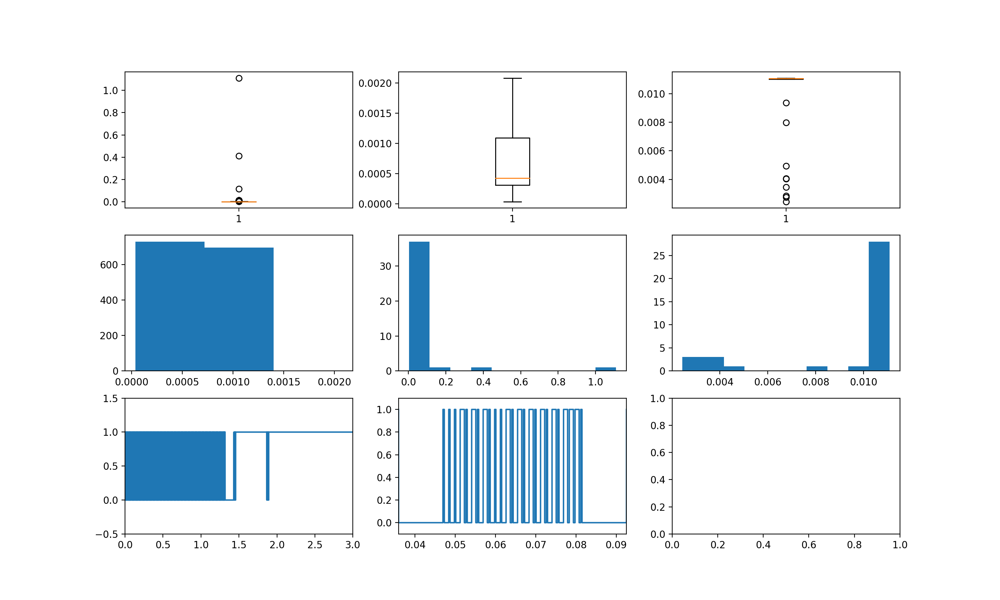

# RF Signal Parser

Raspberry Pi scripts capable of cloning and transmitting RF signals. 

## Requirements

* Raspberry Pi
* RF receiver and transmitter modules
* Python 3.7 or later

## Overview

These scripts were used to replicate a 433 MHz signal from a transmitter unit that was paired with an electrical outlet. The outlet recognizes two signals, corresponding to on and off functionality. Both the on and off sequence are defined by a signal pattern, captured by the Raspberry Pi as a series of 0s and 1s of set time duration. Depending on how long the buttons on the transmitter are pressed, the sequence is sent repeatedly, and multiple transmissions are separated by a delay to demarcate the signals. In order to copy and later transmit one of these sequences, the pattern of 0s and 1s and the time delay between consecutive transmissions are needed. The `receive.py` script is responsible for recording the signal and extracting this sequence and timing information. The `tranmsit.py` script can transmit any signal that has been previously captured. 

## Receive signal

To copy a RF signal, attach a RF receiver to a Raspberry Pi, ensuring the data pin is connected to pin 2. Then run

```
python receive.py action
```

For the next 3 seconds, the script records the signal, and pickles the output for future use. If the pickled output already exists in the directory, the signal reception step is skipped, and the program starts by analyzing the received signal to determine the sequence and timing information needed to replicate the action. 

To start the analysis portion, the script splits the signal into consecutive on and off durations. The script creates a histogram of the durations and selects the bins with the highest counts. The sequence and time delay can be determined using these duration frequencies, since other than long duration 0s or 1s, representing no received signal from the transmitter, the most frequent durations will correspond to the time delay, as well as the pattern that constitutes the message.

The script outputs two files, one containing the sequence and the other containing the timing information.



## Transmit signal

To transmit a RF signal that's been previously recorded, attach a RF transmitter to a Raspberry Pi, ensuring the data pin is connected to pin 2. Then run

```
python transmit.py action
```

The script transmits the sequence 10 times, in case the receiver misses any of the transmissions.